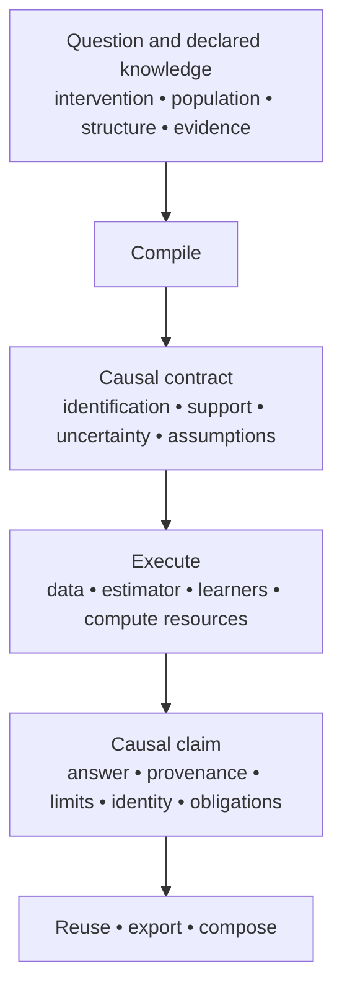

# Antecedent 2.0

> **Release preparation.** The published package remains 1.11.0 while
> Antecedent 2.0 is prepared. This branch documents the 2.0 product and does
> not claim that its deferred calibration program has completed.

Antecedent is designed for causal inference as a composable systems primitive,
built to preserve the epistemic correctness of causal analysis. It unifies
discovery, structural uncertainty, identification, estimation, validation,
interventions, temporal analysis, and durable artifacts in one typed workflow.

Antecedent applies high-assurance engineering principles to causal inference:
claims are explicitly scoped, unsupported combinations fail closed, evidence is
classified, implementations are checked against independent oracles where
available, and provenance and traceability are machine-audited.

**Antecedent is a causal inference system for turning causal questions and
evidence into checked, executable scientific claims.** It is designed not only
to calculate an answer, but to preserve what that answer means—its assumptions,
identification status, empirical support, uncertainty, provenance, and
limits—as the analysis is estimated, reused, combined, saved, transported, and
consumed by other software.

Give it data, a causal question, and a graph or discovery strategy. Antecedent
determines what is identified, runs only a licensed inference path, or refuses
claims the available evidence does not warrant. Results preserve assumptions,
uncertainty, diagnostics, and provenance across system boundaries, so analyses
can be composed, reviewed, reused, and audited without losing scientific
meaning.



Antecedent's job is to stop the meaning at the top of this diagram from
disappearing by the time a result reaches another person or system. Start with
the [system model](docs/system-model.md) before choosing an API.

```python
import antecedent as ant

query = ant.AverageEffect("treatment", "outcome")
identification = ant.identify(graph=graph, query=query, names=list(data))
result = identification.estimate(data)
report = result.inspect().to_dict()
reused = result.study.refresh(new_data)
loaded = ant.load(result.export())
```

`analyze(...)` is the one-call form of the same lifecycle. A successful result
does not prove that a graph is true or that an interval is calibrated for every
population; it makes the assumptions, evidence, support, and calibration scope
available for review.

## One system, several causal jobs

Antecedent combines the established causal workflow—discovery, graph review,
identification, frequentist and Bayesian estimation, validation, interventions,
temporal analysis, counterfactuals, attribution, design, state, and durable
artifacts—with 2.0's new prediction and transport foundations.

- **Learner-backed estimation.** DML, DR-Learner, and honest causal forest
  paths use fold-local nuisance fitting, held-out diagnostics, learner
  provenance, overlap checks, and explicit limits. CATE predictions are not
  pointwise confidence intervals.
- **Structural transport.** Population identity, evidence regimes, available
  experiments, sampling, and selected mechanisms are explicit. A formula can
  be identified yet unavailable to evaluate when a required joint law or
  provider is absent.
- **Preserved epistemic boundaries.** Graph classes remain distinct; priors do
  not turn nonidentification into identification; unsupported combinations
  refuse rather than silently fall back.

The [Python workflow](docs/python-workflow.md), [supported analyses](docs/supported-analyses.md), and [examples](examples/README.md) are the best starting points. The [support matrix](docs/support-matrix.md) is the public license; [capabilities](docs/capabilities.md) is an inventory, not permission to combine every feature.

## Evidence and release status

2.0 retains conformance fixtures, provenance, compatibility migrations, and
machine-checked support boundaries. The full calibration sweep is still a
roadmapped release requirement and has deliberately not been rerun for this
preparation tree. Read `result.calibration` rather than inferring a universal
coverage guarantee.

See the [2.0 draft release notes](docs/release-notes/v2.0.0.md),
[architecture](docs/architecture.md), [artifacts](docs/artifacts.md), and
[development guide](docs/development.md).

## License

MIT OR Apache-2.0 — see [LICENSE-MIT](LICENSE-MIT) and [LICENSE-APACHE](LICENSE-APACHE).
