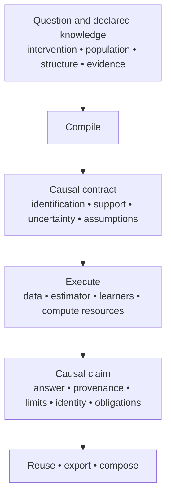

# Antecedent 2.0

[](https://github.com/iridae-dev/antecedent/actions/workflows/ci.yml) [](https://crates.io/crates/antecedent) [](https://pypi.org/project/antecedent/) [](https://github.com/iridae-dev/antecedent/releases/latest) [](https://doi.org/10.5281/zenodo.21556247)

**Antecedent is a high-assurance causal inference compiler:** it turns a causal question and declared structural and evidential assumptions into a typed executable contract, runs an estimator only when that contract permits it, and returns a durable scientific claim with its identification, uncertainty, support, assumptions, and provenance attached.



Antecedent prevents the meaning declared at the start of an analysis from disappearing by the time a result reaches another person or system.

## What’s new in Antecedent 2.0?

Antecedent 2.0 builds on the existing causal workflow—discovery, graph review, identification, frequentist and Bayesian estimation, validation, interventions, temporal analysis, counterfactuals, attribution, design, state, and durable artifacts:

```python
import antecedent as ant

query = ant.AverageEffect("treatment", "outcome")
identification = ant.identify(graph=graph, query=query, names=list(data))
result = identification.estimate(data)
report = result.inspect().to_dict()
reused = result.study.refresh(new_data)
loaded = ant.load(result.export())
```

2.0 adds native prediction and transport foundations to that workflow.

**Learner-backed estimation.** DML, DR-Learner, and honest causal-forest paths use fold-local nuisance fitting, held-out diagnostics, learner provenance, overlap checks, and explicit limits. The standard Python wheel includes the CPU-native `NeuralNet` nuisance learner. CATE predictions are not pointwise confidence intervals.

```python
from antecedent.estimators import DML, DRLearner, CausalForest

query = ant.AverageEffect("treatment", "outcome")
dml = ant.analyze(data, graph=graph, query=query, estimator=DML(learner="auto", folds=5))
# fold-local nuisances: dml.estimate.outcome_oof_r2, .learner_provenance

dr = ant.analyze(data, graph=graph, query=query, estimator=DRLearner(learner="ridge"))
# dr.estimate.cate is a vector of predictions, not a pointwise interval

forest = ant.analyze(
    data, graph=graph, query=query, estimator=CausalForest()
)
# forest.estimate.cate_leaf_dispersion; cate_se stays unset
```

**Structural transport.** Population identity, evidence regimes, available experiments, sampling, and selected mechanisms are explicit. A formula can be identified yet unavailable to evaluate when a required joint law or provider is absent.

```python
query = ant.transport.Transport(
    ant.AverageEffect("treatment", "outcome"),
    target="target",
    evidence=ant.transport.Evidence(
        source=ant.transport.Source(
            "trial",
            kind="experimental",
            interventions=["treatment"],
            sampling="independent",
        ),
        target_sampling="representative_sample",
    ),
)
identification = ant.identify(graph=graph, query=query)
# transportable formula is not yet an estimate
result = identification.estimate(ant.transport.StatisticalTransportData(...))
# missing regime samples leave the functional unavailable
```

Start with the [Python workflow](docs/python-workflow.md), [supported analyses](docs/supported-analyses.md), or [examples](examples/README.md). The [support matrix](docs/support-matrix.md) is the public license; [capabilities](docs/capabilities.md) is an inventory, not permission to combine every feature. What comes after 2.0 is in the [2.x roadmap](ROADMAP.md).

## How Antecedent is built

Antecedent does not treat scientific validity as a layer of documentation around code. Its ability to make a causal claim is represented explicitly and checked at runtime. Think of this as **epistemic type safety** — every supported analysis is governed by machine-readable contracts:

- **The support matrix** defines which combinations of query, graph, evidence, inference mode, and validation level are licensed. Anything outside that surface fails closed.
- **Oracles and parity evidence** record what establishes correctness for an implementation or composition. The presence of an algorithm in the codebase does not, by itself, license its use.
- **Provenance** records how a claim was produced: the causal contract, estimator path, assumptions, evidence, implementation identity, and relevant execution metadata.
- **Calibration status travels with the result.** An interval or uncertainty statement carries its calibration scope and evidence rather than being presented as an unqualified guarantee.
- **Unsupported or unverified cases remain explicit.** Antecedent prefers `unavailable`, `partial`, or refusal over silently widening the claim.

The result distinguishes **implemented**, **tested**, **licensed**, and **scientifically justified** instead of collapsing them into “the function ran.” It means that Antecedent will fail closed (with a reason) if asked to do something unlicensed. That can sound restrictive until you realize that the restriction **is part of the product**.

In most statistical software:

```
function exists → try to run it
```

In Antecedent:

```
algorithm exists ≠ this causal claim is licensed
```

We believe this approach is critical when causal inference is built to exist beyond the notebook as part of composed software systems and agentic workflows.

Read `result.calibration` for the status of a reported interval: `calibrated` means a coverage record matches the execution, the execution is inside that record's scope, and the record still attests the current code. Licensed also does not mean measured: of the 463 licensed cells, 164 have no coverage measurement for their estimator and 4 report no interval (counts in the [support matrix](docs/support-matrix.md)).

For the full 2.0 change summary and migration-impacting changes, read the [release notes](docs/release-notes/v2.0.0.md) and [changelog](CHANGELOG.md).

## License

MIT OR Apache-2.0 — see [LICENSE-MIT](LICENSE-MIT) and [LICENSE-APACHE](LICENSE-APACHE).
