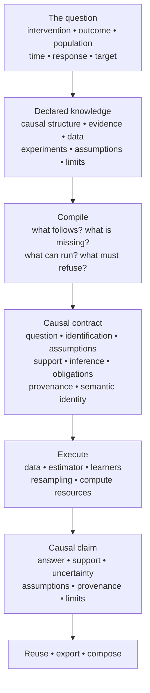

# Antecedent: causal inference as a compiled system

Antecedent turns causal questions and declared evidence into checked,
executable scientific claims. Its purpose is not only to calculate an answer;
it is to preserve what an answer means as an analysis is estimated, inspected,
reused, combined, saved, transported, and consumed by other software.

**Antecedent's job is to stop the meaning on the left from disappearing by the
time you reach the bottom.**

## Why this exists

Many software failures in causal analysis are semantic failures at boundaries.
An estimator returns a number for an unidentified effect. A discovered graph
is later treated as ground truth. A confidence interval is read as structural
uncertainty. A search budget is exhausted and becomes “impossible.” Separate
experiments are accidentally used as a joint experiment. A qualified analysis
is serialized and emerges as `0.23`.

Antecedent makes those transitions explicit and machine-checkable. It does not
guarantee that a causal model describes reality. It instead aims not to make a
stronger causal claim than the declared assumptions, evidence, implemented
methods, and available data warrant.

## Think of it like a compiler

A compiler checks and preserves program meaning across stages. Antecedent
applies the same discipline to causal analysis: causal structure and evidence
compile into an inspectable contract, and that contract is executed against
data to produce a claim. Compilation may succeed, refuse, or expose unresolved
requirements. Those outcomes are scientifically different.

For example, “we have not implemented a method,” “the effect is not
identified,” “the formula needs evidence we do not have,” and “the search ran
out of budget” must not collapse into one missing value.

## Four questions travel with a claim

| Question | Meaning |
| --- | --- |
| **Identification** | Do the causal assumptions and available evidence determine the requested quantity? |
| **Support** | Does the actual data cover the population, intervention, or region needed here? |
| **Uncertainty** | What remains uncertain, which uncertainty is represented, and what supports a reported interval or range? |
| **Assumptions** | What was taken as given to make the claim? |

These slots remain distinct. A predictive model cannot create identification;
more rows cannot repair a missing causal assumption; a diagnostic cannot prove
a graph; and a prior cannot silently turn structural nonidentification into an
identified effect.

Read [the causal contract](causal-contract.md) for the object that carries
these distinctions, then [a result is a claim](result-is-a-claim.md) before the
[Python workflow](python-workflow.md).
